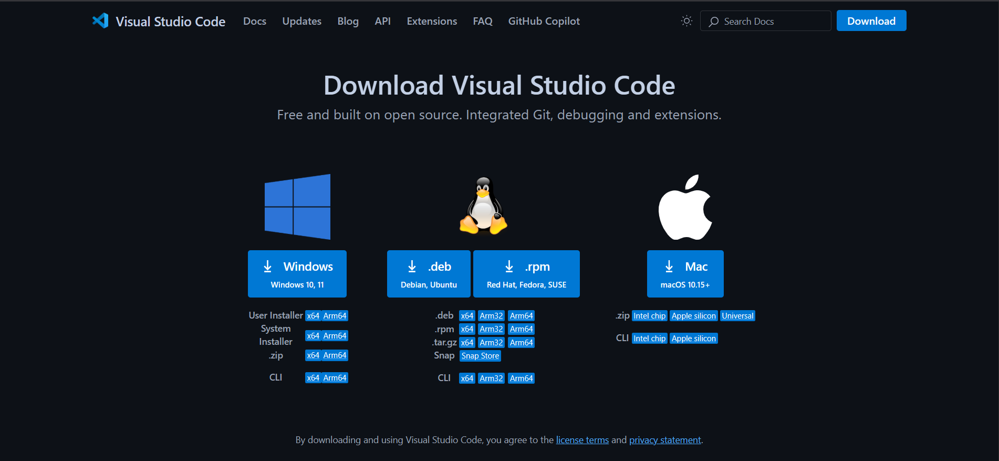
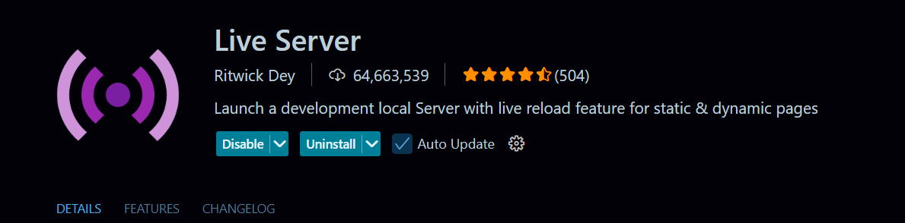
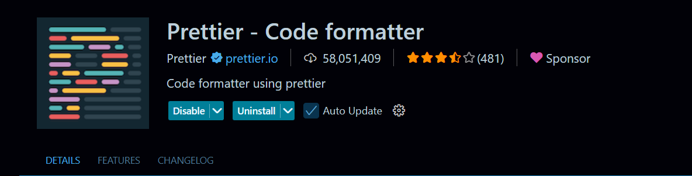
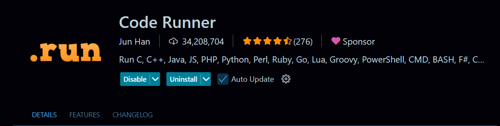
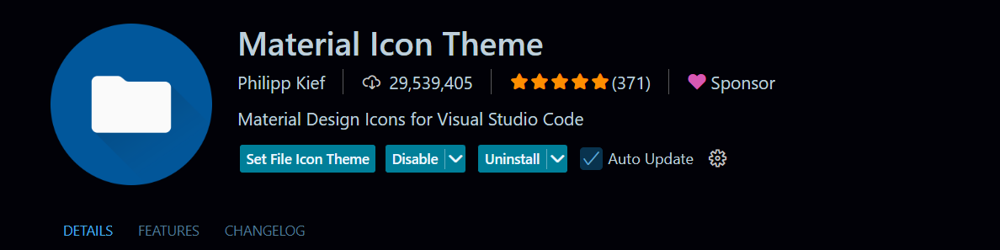

## Docs.dev - Before Coding!

### Where to start?

**In the world of coding**!<br />
Where to start?, is the biggest question nowadays.

Many will suggest you, You can start coding in `notepad`.<br />
Which may be a good idea but not the best.

Because, notepad is capable enough to make a source file.<br />
Open notepad then create a file and save it with extension `.js`
```txt
// index.js
console.log("Hello World!")
```

> [!important]\
> **source file**, is the file which has an specific extension type.\
> And when we exexute the file using a compiler, it produces some output.

*As I said*!<br />
`notepad` is capable enough to create a source file, but it is not a best choice,<br />
If you are targetting to code for longer.

You must go with an **IDE**! ⭐

### What is an `IDE`?

IDE, stands for **I**ntegrated **D**evelopment **E**nvironment.<br />
Which provides all *the facilities you will use to build any project*.

1. **Syntax hightlighting**

    ```js
    console.log("Docs.dev - Before Coding")
    ```

2. **Auto indentation**

    ```js
    function sayHello() {
        console.log("hello!")
    }

    sayHello()
    ```

3. **Integrated terminal**: To run and execute `CLI`s.

4. **Version control**: Default support for version control systems using `git`, `github`, and `gitlab` more.

5. **Extension supports**: To work efficiently and to use different different features in one place.

6. **Language support**: Whether you are coding in `JavaScript`, `Python`, `Java` or any other language, an IDE offers a consistent interface.

### Let's go with `vscode` 😎
*A powerful `IDE` built by **Microsoft***.

Download vscode from the official site:
[install](https://code.visualstudio.com/download)



### Popular extenstion for `vscode` 👇

1. Live server



2. Prettier



3. Code runner



4. Material icons



5. Auto rename tag


6. Polacode


###### Made with 💖!