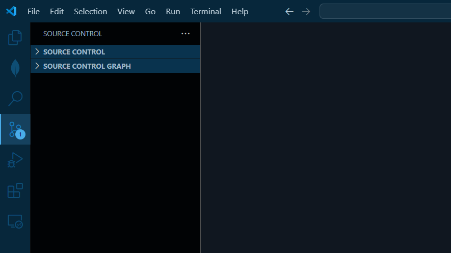
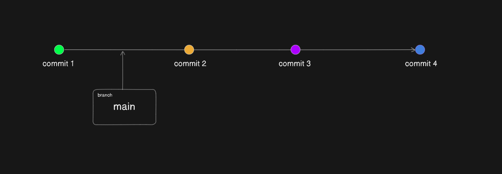
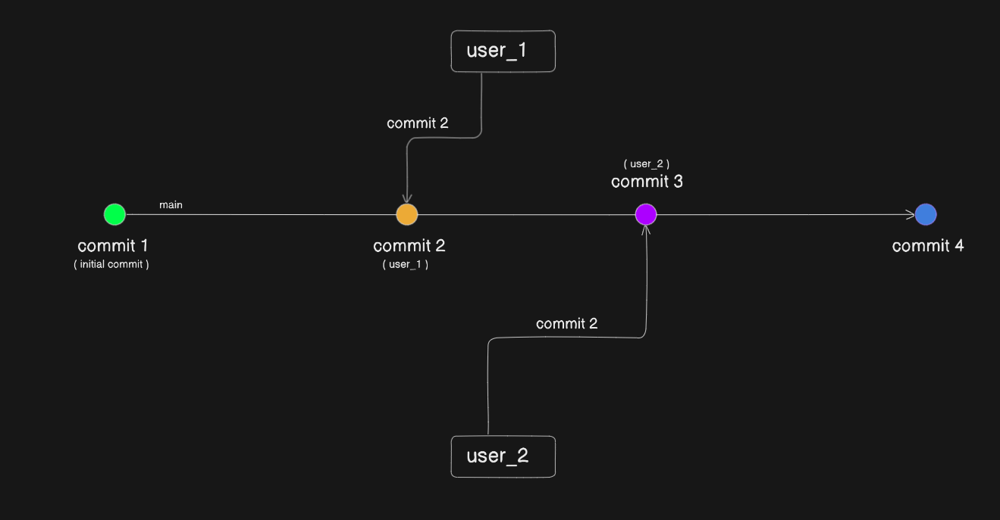
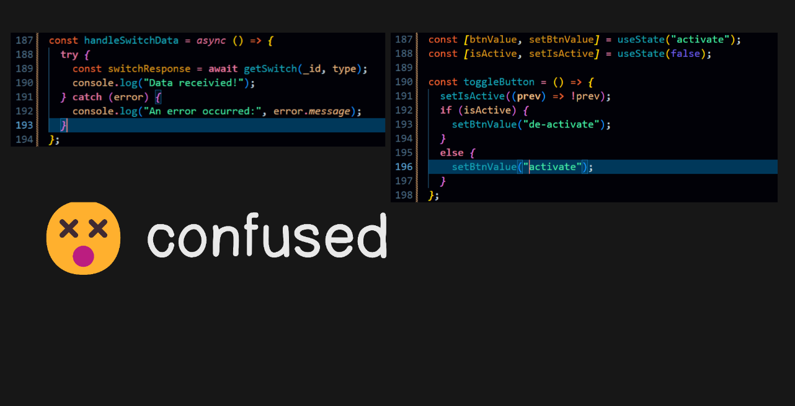
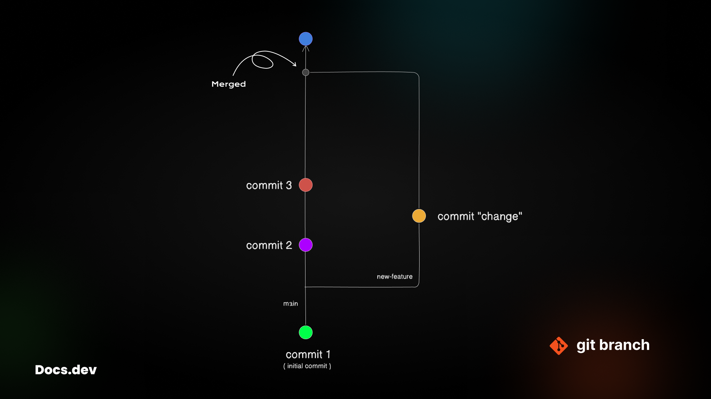

## Docs.dev - Git


**Git** is a distributed version control system that allows developers to track changes in source code during software development.<br/>
Created by _Linus Torvalds_ in 2005, it helps manage project history, collaborate with others, and roll back to previous versions if needed.<br/>
Git stores data as snapshots of the entire project, unlike traditional systems that track file-by-file changes.

---

**[Move to commands](https://github.com/Ninja-Vikash/Docs.dev/tree/main/docs/git#commands-)⚡**

### Key feature of Git

- **Branching**<br/>Developers can create branches to experiment with changes without affecting the main codebase.
- **Merging**<br/>Combines changes from different branches or developers.
- **Commit history**<br/>Records snapshots of changes, enabling easy tracking of project progress.
- **Collaboration**<br/>Supports teamwork by allowing multiple contributors to work on the same project from different locations.

### Let's setup Git

**Windows**: **[Download Git](https://git-scm.com/downloads/win)** and run the installer. You can use the default settings.<br/>
**MacOS**: Git is usually pre-installed. If not, install it using Homebrew

```bash
brew install git
```

**Linux**: Install using your package manager, like this.

```bash
sudo apt update
sudo apt install git
```

#### Configure Git

```bash
git config --global user.name "Your Name"
git config --global user.email "you@example.com"
```

> [!NOTE]\
> Check your configuration with:\
>
> ```bash
> git config --list
> ```

**Finally, Git configured** 🤓<br/>
Now you can use git commands to upload your code into GitHub codebase.

> [!WARNING]\
> Wait... Have you logged in at GitHub? No 😅<br/>
> What are you waiting for, create an account on GitHub with the registered `email` and `username` as per Git config.
>
> Rather then create an account on **GitHub** then config **Git**

### Initialize a Repository

**Don't be confused** 😵<br/>
Repository is noting just a folder. In which your all the code will be stored.

**Let's upload your first project to the GitHub codebase**<br/>
Create an empty folder ( eg. github-demo )

And open it with any code editor. I'm going with VS code.

You can use in-built source control 😉


**Using Git with command lines is really fun**

Let's create a basic website.

Open up terminal or press `ctrl` + &grave;

```bash
touch index.html
```

Write the boiler plate code using `shift` + `!`

```html
<h1>Hello world!</h1>
```

Open it using live server.

> [!NOTE]\
> It is not necessary that you will have to initialize project before starting the project.

Let's initialize now!<br/>

```bash
git init
```

> [!IMPORTANT]\
> `.gitignore` file will help you to ignore any file or directory from tracking
> ```bash
> README.md
> package.json
> node_modules
> ```
You will see, now `index.html` is tracked by git.

```bash
git add .

git commit -m"first commit"
```

Create a repo on GitHub ( eg. demo )

```bash
git remote add origin https://github.com/username/demo.git

git branch -M main

git push -u origin main
```

### Git Commands

Before deep diving to git commands learn the tracking flow.


```bash
# add all untracked files
git add .
```

```bash
# take a snapshot of tracked files with a message
git commit -m"message"
```

> [!NOTE]\
> `-m` flag is used to add commit message

```bash
# upload the tracked files to codebase
git push
```

### Branching

Before learning _branching_ 🔍 have a look on the previous code pushing flow.


There will not be any complication because —<br/> "_you have only one branch that is_ `main` _branch_" 😅

```bash
# list all branch
git branch
```

> [!IMPORTANT]\
> It will not preview all the branches that are on remote

**Create a branch**

```bash
git branch <branch-name>
```

Now, You can list all branches using `git branch`

You have learnt that how to create branch.<br/>
What is the usecase of it? 🧐

**Branch**, is like a separate copy of your local codebase, in the same local setup.

When there is only one branch that is `main`, your all `commit`s will be pushed to `main`.


**Let's discuss the usecase** 🤓<br/>
Working in a team means multiple local setup. Which mean multiple collaborator to push code.<br/>
But there is a problem with many collaborator.


Here is the breakdown, `User_1` has pushed his commit before `User_2` on the `main` branch.<br/>
But the `User_2` still in initial commit state. His local setup is not aware of changes which is done by `User_1`.

`User_2`s local setup has no idea what was the change `User_1` made may be it is a adding code, creating file, modifying a file or deleting a file.

Suppose, `User_2` has modified a file which is deleted or modified in second commit of `User_1`.<br/>
And already pushed to main.

The file is changed in `main` branch. If the `User_2` pushes the change. It will show a conflict.

Because of modifying same file at the same line


Now somehow `User_2` pushes his change to `main` next time `User_1` will have to face conflicts.

**How branching works?**<br/>
Before creating a branch make sure you are in `main` branch. 😀

```bash
# create branch
git branch new-feature

# navigate to branch
git checkout new-feature
```
Alternate
```bash
git checkout -b new-feature
```
> `-b` is a flag to create branch

Check the current branch `git branch`

Now you are able to make changes on newly created branch ( eg. `new-feature` ).<br/>
Once the changes have done, you can push the changes to remote.

```bash
git add .

git commit -m"change"

git push -u origin new-feature
```
> [!WARNING]\
> Default upstream is set to `main`
>
> `-u` flag is used change the upstream so that next time when you push the code from `new-feature` branch\
> You can use the `git push` command.
>
> `origin` creates branch on remote for current push, if not existed.
>
> Alternate
> ```bash
> git push origin main
> ```
> Will push changes on remote but does not change upstream.\
> In this case if you switch back to main branch for few changes to push directly into main.\
> ```bash
> # switch branch
> git checkout main
> 
> # push changes from main
> git push 
> ```


**Work is not over yet** 😉<br/>
You have just pushed changes to new branch ( eg. `new-feature` ), It does not mean all the changes will reflect to `main` branch.

What!<br/>
— "*Is there any bug?*" 🥲

Because, Your `new-feature` branch is independent.<br/>
You will have to say the remote — my branch is done with changes, you please merge it.

Kidding, Just open up your repo in GitHub and raise a `pull request`. Once it merged to `main` branch your changes will reflect on `main`.

> [!IMPORTANT]\
> Once your branch is merged to `main`\
> You will have to update your `main` branch
> ```bash
> # switch to main
> git checkout main
> 
> # pull changes
> git pull origin main
> ```
> If your upstream is not changed
> ```bash
> git pull
> ```

After merge your flow will be


***

### Commands ⚡
```bash
# clone
git clone <repository-url>

# initialize
git init

# check status
git status

# add to track
git add .

# take snapshot
git commit -m"message"

# push changes
git push

# list branch
git branch

# create branch
git branch new-feature

# switch branch
git checkout new-feature

# create and switch branch
git checkout -b new-feature

# push on branch ( without modifying upstream )
git push origin new-feature

# push on branch ( with modifying upstram )
git push -u origin new-feature

# pull changes
git pull

# pull from branch
git pull origin new-feature

# check commits history
git log

# check commits name
git log --oneline

# delete a branch ( safe, ensures no unmerged changes )
git branch -d <branch-name>

# delete a branch ( forcefully )
git branch -D <branch-name>

# pluck all changes from any branch
git stash

# apply all plucked changes
git stash apply

# reset all current changes
git reset --hard
```

**Crafted with 💖!**