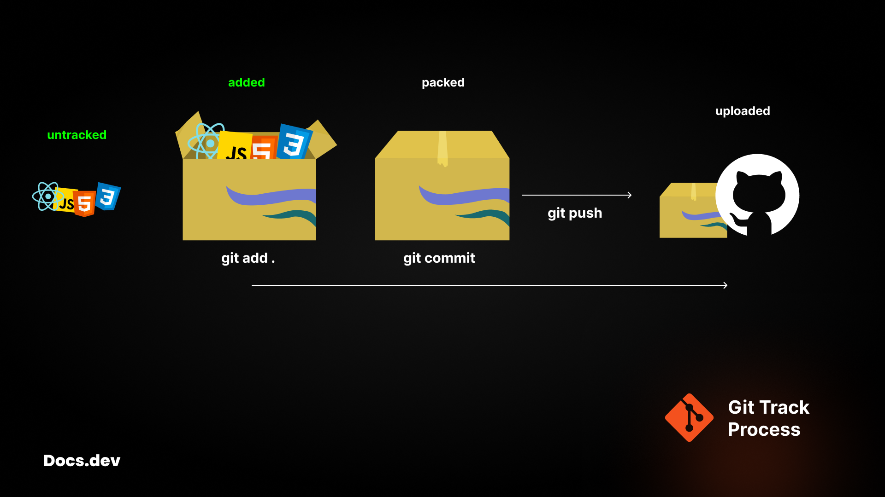

## Docs.dev - Git


**Git** is a distributed version control system that allows developers to track changes in source code during software development.<br/>
Created by _Linus Torvalds_ in 2005, it helps manage project history, collaborate with others, and roll back to previous versions if needed.<br/>
Git stores data as snapshots of the entire project, unlike traditional systems that track file-by-file changes.

---

### Key feature of Git

- **Branching**<br/>Developers can create branches to experiment with changes without affecting the main codebase.
- **Merging**<br/>Combines changes from different branches or developers.
- **Commit history**<br/>Records snapshots of changes, enabling easy tracking of project progress.
- **Collaboration**<br/>Supports teamwork by allowing multiple contributors to work on the same project from different locations.

### Let's setup Git

**Windows**: **[Download Git](https://git-scm.com/downloads/win)** and run the installer. You can use the default settings.<br/>
**MacOS**: Git is usually pre-installed. If not, install it using Homebrew
```bash
brew install git
```
**Linux**: Install using your package manager, like this.
```bash
sudo apt update
sudo apt install git
```

#### Configure Git
```bash
git config --global user.name "Your Name"
git config --global user.email "you@example.com"
```
> [!NOTE]\
> Check your configuration with:\
> ```bash
> git config --list
> ```

**Finally, Git configured** 🤓<br/>
Now you can use git commands to upload your code into GitHub codebase.

> [!WARNING]\
> Wait... Have you logged in at GitHub? No 😅<br/>
> What are you waiting for, create an account on GitHub with the registered `email` and `username` as per Git config.
>
> Rather then create an account on **GitHub** then config **Git**

### Initialize a Repository

**Don't be confused** 😵<br/>
Repository is noting just a folder. In which your all the code will be stored.

**Let's upload your first project to the GitHub codebase**<br/>
Create an empty folder ( eg. github-demo )

And open it with any code editor. I'm going with VS code.

You can use in-built source control 😉


**Using Git with command lines is really fun**

Let's create a basic website.

Open up terminal or press `ctrl` + &grave;

```bash
touch index.html
```
Write the boiler plate code using `shift` + `!`

```html
<h1>Hello world!</h1>
```

Open it using live server.

> [!NOTE]\
> It is not necessary that you will have to initialize project before starting the project.

Let's initialize now!<br/>
```bash
git init
```
You will see, now `index.html` is tracked by git.
```bash
git add .

git commit -m"first commit"
```

Create a repo on GitHub ( eg. demo )

```bash
git remote add origin https://github.com/username/demo.git

git branch -M main

git push -u origin main
```


### Git Commands

Before deep diving to git commands learn the tracking flow.


```bash
# add all untracked files
git add .
```
```bash
# take a snapshot of tracked files with a message
git commit -m"message"
```
> [!NOTE]\
> `-m` flag is used to add commit message
```bash
# upload the tracked files to codebase
git push
```

<!-- #### Branching -->
