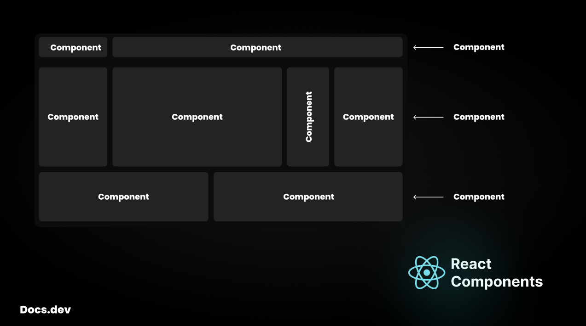

## Docs.dev - React Components and Export methods

### What is a component?

In React, a component is a reusable, self-contained block of code that defines a part of the user interface (UI).<br/>Think of components as the building blocks of a website. Each component can be as small as a button or as large as an entire page.<br/>By combining multiple components together, you can construct complex UIs.



#### How to create a component in `React`?

Creating a component in `React` is like a piece of cake. 😋

For example you want to create a component with some content.

```jsx
// src/components/Greet.jsx

import React from "react";

function Greet() {
    return <h1>Docs.dev</h1>;
}

export default Greet;
```

A component is nothing just a function which returns `JSX` code itself.

> [!warning]\
> A component name must start with **capital letter**
>
> ```jsx
> function Greet() { ... }      // Valid component ✅
> function greet() { ... }      // Not valid component ❎
> ```
>
> Which is a `React` standard.

#### How to use components?

Your `App.jsx` is the entry point for your application's interface.

```jsx
// App.jsx

import React from "react";
import Greet from "./components/Greet.jsx";

function App() {
    return <Greet />;
}

export default App;
```

> [!tip]\
> We are not going to write the all `import`, `export` and `function()` statements.
>
> Instead we will use a vscode extension
> 
> and it provides snippets to write the boilers with very ease\
> `rfce` → react functional component with export

#### What is a Nested component in `React`?

Nested component, Which is only accessible inside one component.<br />
In simple terms Nested component used to encapsulate components logic in the same component.

Lets understand with an example.

```jsx
// App.jsx

import React from "react";

function ChildComponent() {
    return <h2>Child Component</h2>;
}

function App() {
    return <ChildComponent />;
}

export default App;
```

`App.jsx` has a nested component as `<ChildComponent />` which is only accessible within `App.jsx`.<br/>
You can't import `<ChildComponent />` in another component.

### Learn `export` methods

There are two types of modular `export`s

-   **default export**<br/>
    When a module is exported as default export then it can be accessible using any name from that file.<br/>

    ```js
    // methods.js

    const currentDate = () => {
        // code...
    };

    export default currentDate;
    ```

    Accessing the module using default export

    ```jsx
    // App.jsx

    import React from "react";
    import currentDate from "methods.js";

    function App() {
        const getDate = () => {
            const getDate = currentDate();
            console.log(getDate);
        };
        getDate();

        return <div>Docs.dev</div>;
    }
    ```

    > [!NOTE]\
    > Instead of `currentDate` we can import as
    >
    > ```jsx
    > import dateFunction from "methods.js";
    > ```
    >
    > or whatever we want to call this method.

-   **named export**<br/>
    When a module is exported as named export then it can only be accessible by its exact name.<br/>

    ```js
    // methods.js

    const currentDate = () => {
        // Code...
    };

    export { currentDate };
    ```

    Accessing the module using named export

    ```js
    // App.jsx

    import React from "react";
    import { currentDate } from "methods.js";

    function App() {
        const getDate = () => {
            const getDate = currentDate();
            console.log(getDate);
        };
        getDate();

        return <div>Docs.dev</div>;
    }
    ```

> [!tip]\
> We can write the named `export` module as
>
> ```js
> export const currentDate = () => {
>     // Code...
> };
> ```

### Learn about barrel `export`

A barrel file is used to group and re-export multiple modules (functions, components, utilities, etc.) from a single entry point.

```bash
/components
  ├── Button.js
  ├── Card.js
  └── index.js
```

```js
// index.js
export { default as Button } from "./Button";
export { default as Card } from "./Card";
```

**Happy Coding ❤️!**
