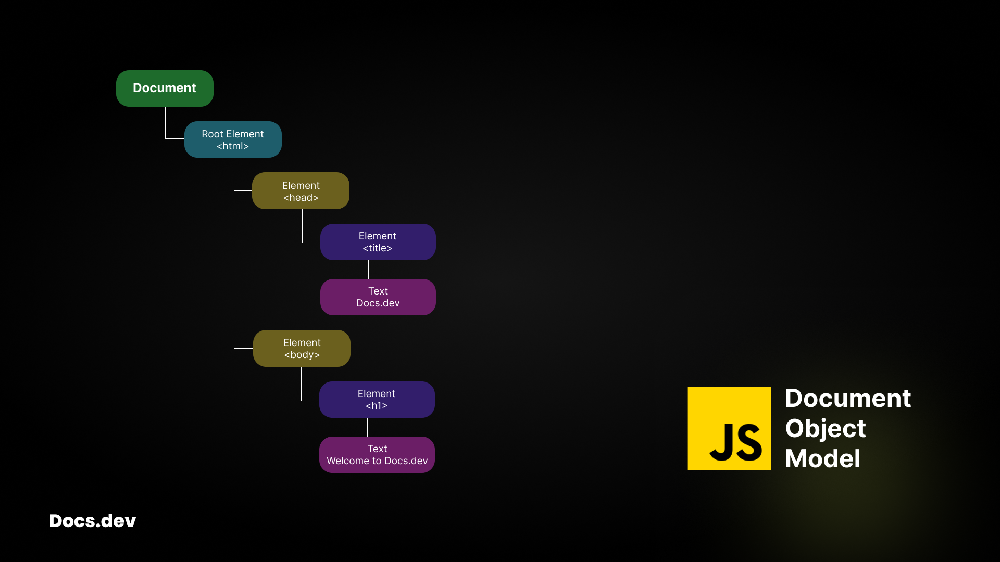

## Docs.dev - react.js - Basics

### DOM
The DOM is an object representation of the HTML element, thats acts as a bridge between your code and the user interface. It has Tree-Like structure with parent and child relationship.

<!--  -->


### Updating UI with JavaScript
```js
<body>
    <div id="app"></div>
    <script type="text/javascript">
        const app = document.getElementById("app")

        const header = document.createElement("h1")
        header.innerText = "Hello React!"

        app.appendChild(header)
    </script>
</body>
```

### Nesting multiple elements
```js
<body>
    <div id="app"></div>
    <script type="text/javascript">
        const app = document.getElementById("app")

        // create header node
        const header = document.createElement("header")
        header.innerHTML = "<h1>Hello React Developer!</h1>"

        // create footer node
        const footer = document.createElement("footer")
        footer.innerHTML = "<p>Copyright reserved!</p>"

        // create parent container
        const main = document.createElement("main")

        // use a proper order
        main.appendChild(header)
        main.appendChild(footer)

        app.appendChild(main)
    </script>
</body>
```

**But it will become a problem, on working with a large project**<br/>To solve this problem **React come into existence**

To use React in your newly created project, We need two React scripts from an external website [`unpkg.com`](https://legacy.reactjs.org/docs/cdn-links.html)

- **react** script to enable react in your project
```js
<script src="https://unpkg.com/react@18/umd/react.development.js"></script>
```
- **react-dom** script to enable the creation of nodes
```js
<script src="https://unpkg.com/react-dom@18/umd/react-dom.development.js"></script>
```
### Source code will look like
```html
<body>
    <div id="app"></div>
    
    <script src="https://unpkg.com/react@18/umd/react.development.js"></script>
    <script src="https://unpkg.com/react-dom@18/umd/react-dom.development.js"></script>
    <script type="text/javascript">
        const app = document.getElementById("app")

        const header = document.createElement("h1")
        header.innerText = "Hello React!"

        app.appendChild(header)
    </script>
</body>
```

Instead of using the appendChild method now, we can use React methods for creating and rendering elements on the browser.
```html
<body>
    <div id="app"></div>

    <script src="https://unpkg.com/react@18/umd/react.development.js"></script>
    <script src="https://unpkg.com/react-dom@18/umd/react-dom.development.js"></script>
    <script type="text/javascript">
        const app = document.getElementById("app")

        const root = ReactDOM.createRoot(app).render(<h1>Hello React!</h1>)
    </script>
</body>
```
> [!IMPORTANT]
> Since react documents works with JSX but browser does not understand JSX.\
> Therefore we need a transpiler in this case we will use **Babel** as a transpiler.

```js
<script src="https://unpkg.com/@babel/standalone/babel.min.js"></script>
```
#### Now take a look on the source code
```html
<body>
    <div id="app"></div>

    <script src="https://unpkg.com/react@18/umd/react.development.js"></script>
    <script src="https://unpkg.com/react-dom@18/umd/react-dom.development.js"></script>
    <script src="https://unpkg.com/@babel/standalone/babel.min.js"></script>
    <script type="text/jsx">
        const app = document.getElementById("app")

        const root = ReactDOM.createRoot(app).render(<h1>Hello React!</h1>)
    </script>
</body>
```

We can create a function component for rendering
```html
<body>
    <div id="app"></div>

    <script src="https://unpkg.com/react@18/umd/react.development.js"></script>
    <script src="https://unpkg.com/react-dom@18/umd/react-dom.development.js"></script>
    <script src="https://unpkg.com/@babel/standalone/babel.min.js"></script>
    <script type="text/jsx">
        const app = document.getElementById("app")

        function Header(){
            return <h1>Hello React!</h1>
        }

        const root = ReactDOM.createRoot(app).render(<Header/>)
    </script>
</body>
```

**Happy Coding 💖**
