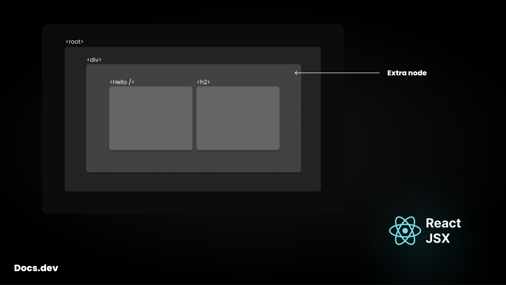

## Docs.dev - JSX & React Fragment

### What is `JSX`?
`JSX` (JavaScript XML) is essentially a syntax extension for JavaScript that allows you to write HTML-like code directly within your JavaScript files.<br/>It is not a different language but a combination of `JavaScript` and `XML` that React uses to create UI elements.

In `JSX`, you can write HTML-like code, which makes it easier to visualize the structure of your components while still being able to use the full power of JavaScript to manipulate the DOM.<br/>This syntax gets transpiled into pure JavaScript, which is what the browser eventually reads.

### Benefits of `JSX`
- **Familiar Syntax**<br/>JSX allows developers to write code that closely resembles HTML, making it easier to understand and faster to learn for those already familiar with frontend technologies.

- **Enhanced Readability**<br/>JSX makes components easier to read and maintain because the structure closely matches the rendered UI.

- **Power of JavaScript**<br/>While you can use HTML-like syntax, you still have full access to JavaScript features like `loops`, `conditions`, and `functions` directly within JSX.

- **Better Debugging**<br/>Errors in JSX show more meaningful error messages, which helps in debugging during development.

- **Seamless Integration**<br/>JSX is used to create components, combining the logic of UI rendering with layout, making it more intuitive and reducing the gap between logic and design.

In essence, JSX bridges the gap between traditional HTML and JavaScript, giving developers a powerful tool to create *dynamic user interfaces*.

#### Lets see how JSX works

```jsx
import React from "react";

function App() {
    return (
        // JSX Statement
    )
}

export default App;
```

> [!WARNING]\
> A component must have to return `jsx`, so it should not be empty.\
> A component is only capable of returning one element.
> ```jsx
> function App() {
>     return (
>         <Hello />                 // Error
>         <h2>Docs.dev</h2>         // Error
>     )
> }
> ```
>
> Instead you can write
> ```jsx
> function App() {
>     return (
>        <div>
>            <Hello />
>            <h2>Docs.dev</h2>
>        </div>
>     )
> }
> ```

### React Fragments ✨
Fragments are just wrappers used to wrap up multiple elements inside JSX statement.<br/>
If you don't want any extra node in your DOM.
```jsx
function App() {
    return (
       <div>      // wrapper
           <Hello />
           <h2>Docs.dev</h2>
       </div>
    )
}
```

In the above component we are wrapping up the elements using another element.<br/>
And if we see the DOM structure we will see an unwanted node.



In react we write *Fragments* as empty tags `<>Docs.dev</>`.
```jsx
function App() {
    return (
        <>      // React fragment
            <Hello />
            <h2>Docs.dev</h2>
        </>
    )
}
```
Fragments don't create any additional node in DOM.