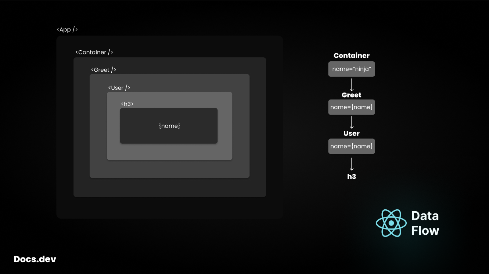

## Docs.dev - Props & Data flow

### What is props?
*Props are used to pass data from parent to child components.*<br/>
When it comes to render identical component with different data.

```jsx
import React from "react";

function Greet() {
    return <h2>Hello, world</h2>
}

function App() {
    return (
        <>
            <Greet />
            <Greet />
        </>
    )
}

export default App;
```
In the above code block the `<Greet />` component is rendering twice, but the content is the same.

**Do you know?**<br/>
You can manipulate the content of any component using props. 🤓

Lets understand with an example.
```jsx
import React from "react";

function Greet(props) {
    return <h2>Hello, {props.value}</h2>
}

function App() {
    return (
        <>
            <Greet value="world!" />
            <Greet value="react" />
        </>
    )
}

export default App;
```

#### How to pass props?
You can pass props as `attribute` alike HTML in a component.
```jsx
function App() {
    return (
        <>
            <Greet value="world!" />
            <Greet value="react" />
        </>
    )
}
```
And access the prop data within the component using `props` parameter.<br/>
Inside component defintion.
```jsx
function Greet(props) {
    return <h2>Hello, {props.value}</h2>
}
```

#### Multiple props
You can also pass multiple props in a component.
```jsx
function User(props) {
    return <h3>I'm, {props.name}. A passionated {props.role}</h3>
}

function App() {
    return (
        <>
            <User name="ninja" role="frontend-developer" />
            <User name="john" role="backend-developer" />
        </>
    )
}
```

### Props Destructuring
You have learned that how to pass `props`.

Many of time you will have to pass more than one props.<br/>
Now, You are thinking about what is the big deal.

Data can be passed like this.
```jsx
function App() {
    return (
        <User
            name="ninja"
            role="frontend-developer"
            expertize="react"
            location="jamshedpur"
            contact="ninjacoder07@gmail.com"
        />
    )
}
```
Have a look on accessing the data.
```jsx
function User(props) {
    return (
        <h3>
            I'm {props.name} and I am a {props.role}.
            I have expertize in {props.expertize} based in {props.location}.
            Book a meeting on {props.contact}.
        </h3>
    )
}
```

Here is a solution to avoid writing props multiple times.

`props` → is an `Object`<br/>
Lets destruct it
```jsx
function User({ name, role, expertize, location, contact }) {
    return (
        <h3>
            I'm {name} and I am a {role}.
            I have expertize in {expertize} based in {location}.
            Book a meeting on {contact}.
        </h3>
    )
}
```

### Concise way of props passing

You can follow a best pratice of data passing as an `Object`

```jsx
function App() {
    return (
        <User
            userData={{
                name: "ninja",
                role: "frontend-developer",
                expertize: "react",
                location: "jamshedpur",
                contact: "ninjacoder07@gmail.com"
            }}
        />
    )
}
```

Extracting values from an `Object`
```jsx
function User({ userData }) {
    const { name, role, expertize, location, contact } = userData;
    return (
        <h3>
            I'm {name} and I am a {role}.
            I have expertize in {expertize} based in {location}.
            Book a meeting on {contact}.
        </h3>
    )
}
```

### Data Flow & Prop Drilling


> [!IMPORTANT]\
> Data flows from top level component to nested level components.\
> `Parent` → `Children` → `GrandChild` → `...`

*Prop Drilling* is a concept of passing data to one component to other.

You need to understand the data flow structure of your app.

```jsx
function App() {
    return (
        <>
            <Container name="ninja" />
        </>
    )
}
```
```jsx
// container component
function Container({name}) {
    return (
        <Greet name={name} />
    )
}

// greet component
function Greet({name}) {
    return (
        <User name={name} />
    )
}

// user component
function User({name}) {
    return <h3>{name}</h3>
}
```
